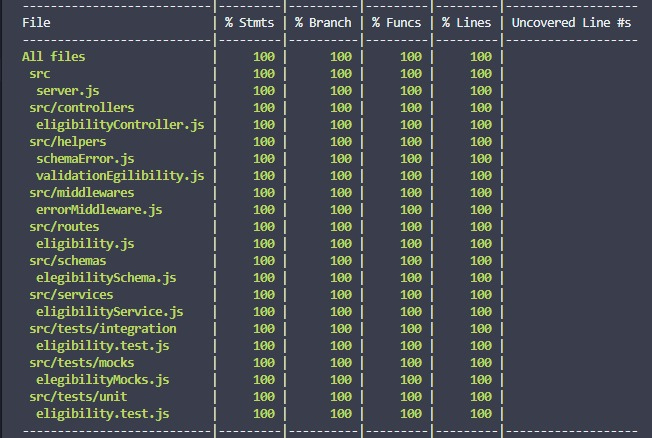

# Lemon Energia API

Este projeto é uma API que tem como objetivo avaliar a elegibilidade de um cliente para a Lemon Energia. Para isso, é necessário que o cliente envie os dados de sua conta de luz. A partir desses dados, se for elegível, é possível calcular a quantidade de CO2 que a empresa deixaria de emitir caso usasse energia limpa. Em caso de não elegibilidade, retorna os motivos para tal.

## Tecnologias utilizadas

- **Node.js** e **Express** para a criação da API
- **Chai** e **Mocha** para os testes
- **ESLint** para padronização de código
- **Joi** para validação de dados
- **Nodemon** para reiniciar o servidor automaticamente
- **Docker** para containerização da aplicação
- **Docker Compose** para gerenciamento de containers
- **Postman** para testes da API
- **VSCode** para edição de código

## Como rodar o projeto

Primeiro passo: clonar o repositório

```bash
git clone git@github.com:angelicapedroso/tst-l.git
```

### Utilizando npm

Instale as dependências através do comando:

```bash
npm install
```

Para rodar o projeto, execute o comando:

```bash
npm start
```

### Utilizando Docker

Para rodar o projeto utilizando Docker, execute o comando:

```bash
docker-compose up
```

## Como utilizar a API

A API pode ser acessada localmente através da URL: http://localhost:3001

### Endpoints

- POST /eligibility

Para utilizar o endpoint, é necessário enviar um JSON com os dados da conta de luz do cliente. O formato do JSON deve ser o seguinte:

```json
{
  "numeroDoDocumento": "14041737706",
  "tipoDeConexao": "bifasico",
  "classeDeConsumo": "comercial",
  "modalidadeTarifaria": "convencional",
  "historicoDeConsumo": [
    3878,
    9760,
    5976,
    2797,
    2481,
    5731,
    7538,
    4392,
    7859,
    4160,
    6941, 
    4597  
  ]
}
```

Onde:

- numeroDoDocumento: CPF ou CNPJ do cliente
- tipoDeConexao: monofasico, bifasico ou trifasico
- classeDeConsumo: residencial, industrial, comercial, rural ou poderPublico
- modalidadeTarifaria: azul, branca, verde ou convencional
- historicoDeConsumo: lista com o consumo de energia mensal, entre 3 e 12 meses

## Testes

A aplicação conta com uma cobertura de testes de 100%. Para rodar os testes, execute o comando:

```bash
npm test
```



## Autor

- [Angélica Pedroso](https://www.linkedin.com/in/angelica-pedroso/)
